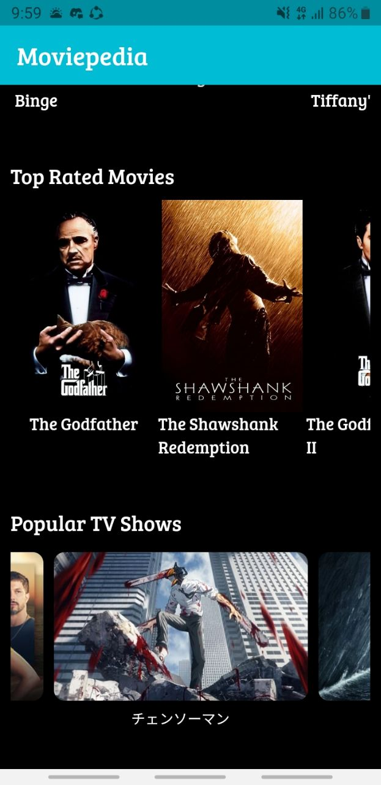

# Moviepedia
>aplikasi flutter untuk melihat detail dari film dan tv show yang sedang tren, terbaik dan populer.
>>Aplikasi ini dibuat dengan menggunakan flutter dan API dari themoviedb.org
>>Aplikasi ini dibuat untuk memenuhi tugas akhir mata kuliah Pemrograman Mobile
>>ketiga widget yang ada pada aplikasi ini adalah:
>>>1. Trending Movies
>>>2. Top Rated Movies
>>>3. Popular TV shows

>## dibuat oleh: Reynaldi Fakhri Pratama

<b>tampilan utama</b>  
  
<b>tampilan ketika di click</b>  
  

## link pitch deck

 <a href="https://docs.google.com/presentation/d/1JI5VjNo152NZ6Y7s05DBQnFu6aiMTXkrxzbCwkCXEXU/edit?usp=sharing">Google Slide</a> 

